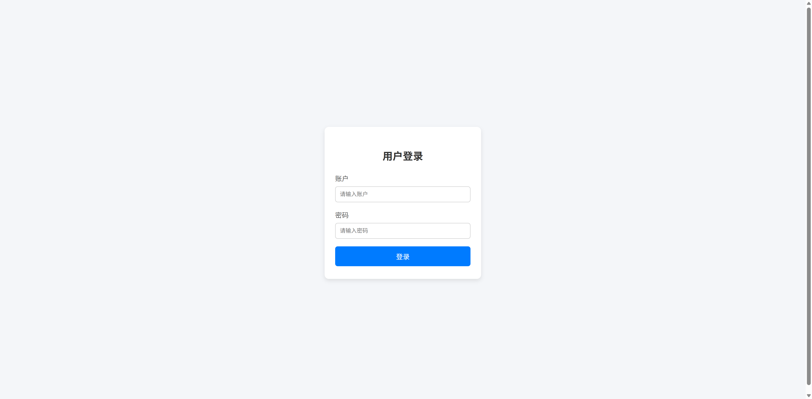
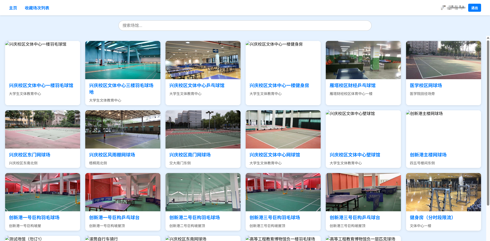
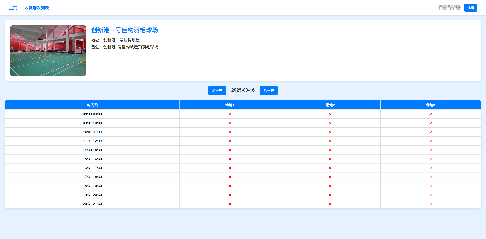
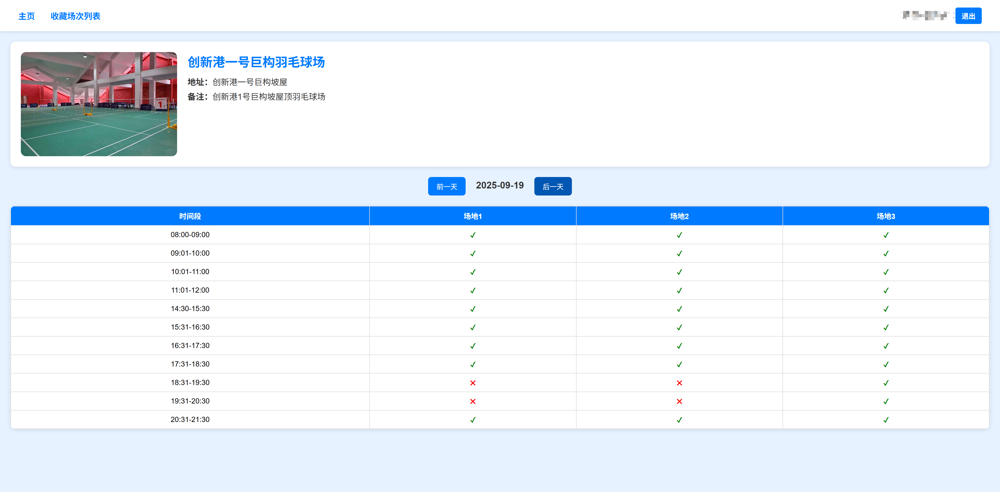
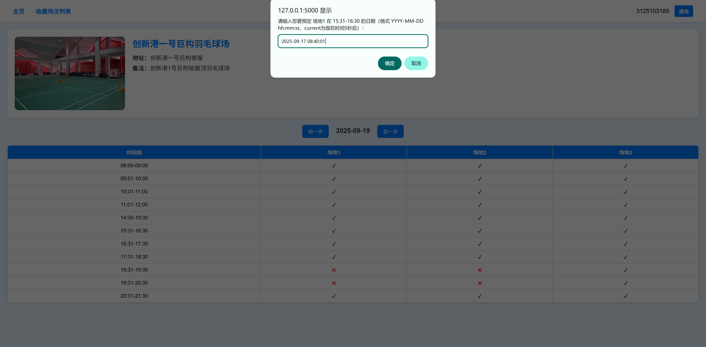
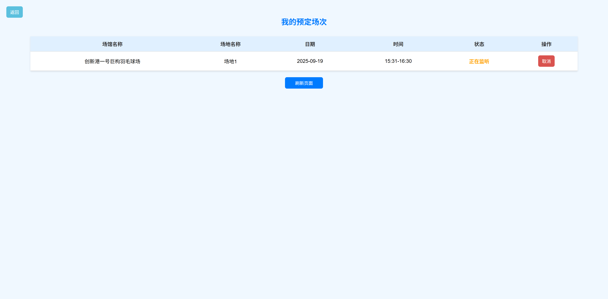

# 🏸 XJTUCourtMaster  

**S5037 杨牧天**  

<p align="center">
  
  
</p>  

<p align="center">
  <sub style="color:gray;">左边是作者，右边是作者室友</sub>
</p>  

---

## 📖 项目简介  

由于经常抢不到 **巨构一号（能动学院 7 楼）** 的羽毛球场，因此开发了这个 **自动抢场地程序**（包括但不限于羽毛球场）。  

核心功能：  
- 🐍 使用 Python 作为主要语言  
- 🕵️ 抓包 [移动交大 APP](https://ywtb.xjtu.edu.cn/dataService/H5/pc/index.html) 接口  
- 🖼️ 数字图像处理算法实现 **滑块验证码识别**  
- 🖱️ 模拟人工手势滑动（随机加速度轨迹）  
- ⏰ 基于 APScheduler 实现 **定时预约**  
- 🌐 提供基于 **Flask + HTML5** 的操作界面  

---

## 🚀 使用方式  

### 1. 启动项目  
在本地部署项目，进入根目录，运行：  
```bash
python app.py
````

然后打开浏览器访问： [http://127.0.0.1:5000](http://127.0.0.1:5000)



---

### 2. 登录界面

输入移动交大 APP 的账户和密码，进入主界面（信息会自动保存，下次可直接登录）。

主界面分为三部分：

1. **导航栏**：主页、收藏场次、用户名（学号）+退出按钮
2. **搜索框**：通过关键词搜索场馆
3. **场馆卡片**：展示预约入口

例子：点击“创新港一号巨构羽毛球场”进入详情页。



---

### 3. 查看详情

详情页的表格展示了不同日期、不同场地的预约情况：

* `×` 表示不可预约
* `√` 表示可预约

可通过中间的日期切换按钮浏览不同日期的信息。



---

### 4. 设置预约

将日期切换为 **09-19**（对应 09-17 08:40 开始抢），点击任意对号进行预约。



输入时间（格式：`YYYY-MM-DD hh:mm:ss`，注意空格和英文冒号），点击确认。
显示“预约成功”即表示设置完成。



---

### 5. 查看收藏场次

点击导航栏的 **收藏场次**，即可查看所有已预约的场次信息。



